<p align="right">
<a href="./GUIDE.md">Read in English</a>
</p>

<div align="center">

# ✦ Arcadia para Todos ✦

> Este guia é destinado a qualquer pessoa que queira usar o Arcadia sem experiência em programação ou aprendizado de máquina.

</div>

<p align="center">
———————————————— 🙡 ————————————————
</p>

## Antes de começar

Para seguir este guia, você precisa apenas de:

- Uma conta do Google
- Uma conexão com a internet
- Um navegador moderno (Chrome, Firefox, Edge ou Safari)

Você **não** precisa instalar Python, Git ou qualquer outro software.

## O que é o Arcadia?

O Arcadia é um aplicativo que permite conversar com modelos de Inteligência Artificial (IA).

Esses modelos de IA podem ser executados:

- **Na nuvem do Google**, usando o Google Colab (recomendado)
- **No seu próprio computador**

Para a maioria dos usuários, o Google Colab é a opção mais simples, pois não é necessário instalar nada.

## Onde o Arcadia é executado?

O Arcadia oferece suporte a duas formas de executar modelos de IA.

### Google Colab (Recomendado)

O Google Colab executa tudo na nuvem do Google.

Esta é a opção mais fácil porque:

- Não é necessário instalar nada.
- Funciona diretamente no navegador.
- É compatível com a maioria dos computadores.
- O Google fornece os recursos computacionais.

### Seu próprio computador (Avançado)

Executar o Arcadia localmente oferece mais controle, mas normalmente exige:

- Python
- Git
- Um computador com capacidade de processamento adequada
- Conhecimentos básicos de linha de comando

Se esta é a sua primeira vez usando o Arcadia, recomendamos utilizar o **Google Colab**.

# Executando o Arcadia

## 1. Abra o notebook

O Google Colab utiliza **notebooks**.

Um notebook é um documento que contém explicações e trechos de código que podem ser executados um de cada vez. Cada trecho é chamado de **célula**.

Abra o notebook do Arcadia:

**https://colab.research.google.com/github/lasicuefs/arcadia/blob/main/play.ipynb**

Você verá algo semelhante a isto:

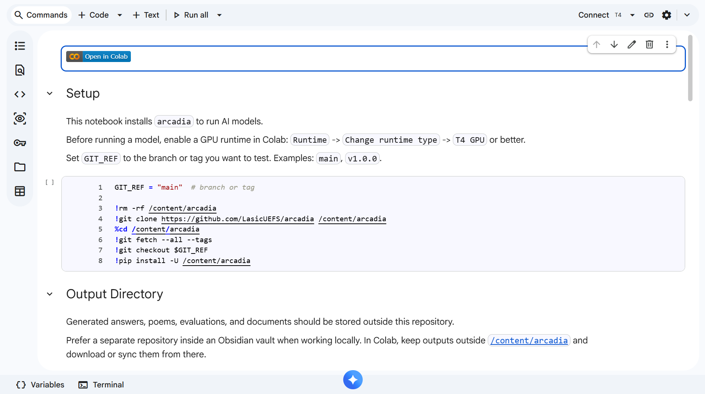

## 2. Prepare o Google Colab

Antes de executar o Arcadia, será necessário preparar o notebook.

### Escolha um ambiente de execução

O Google Colab fornece um computador temporário chamado **ambiente de execução** (*runtime*).

O Arcadia é executado nesse ambiente, e não diretamente no seu computador.

Para a maioria dos usuários, a **GPU T4** oferece o melhor equilíbrio entre desempenho e disponibilidade.

### Conecte-se a uma GPU T4

Esta é a forma mais simples de começar.

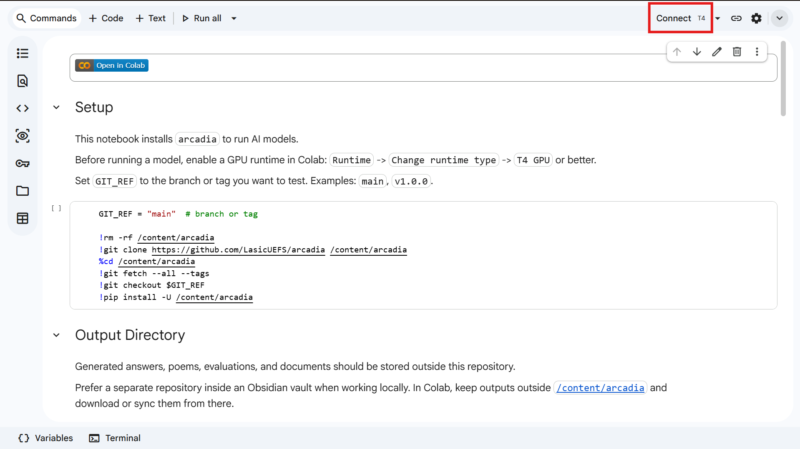

### Escolha outro ambiente de execução (Opcional)

Se preferir utilizar outro ambiente de execução:

1. Clique no menu ao lado de **Conectar**.
2. Selecione **Alterar tipo de ambiente de execução**.

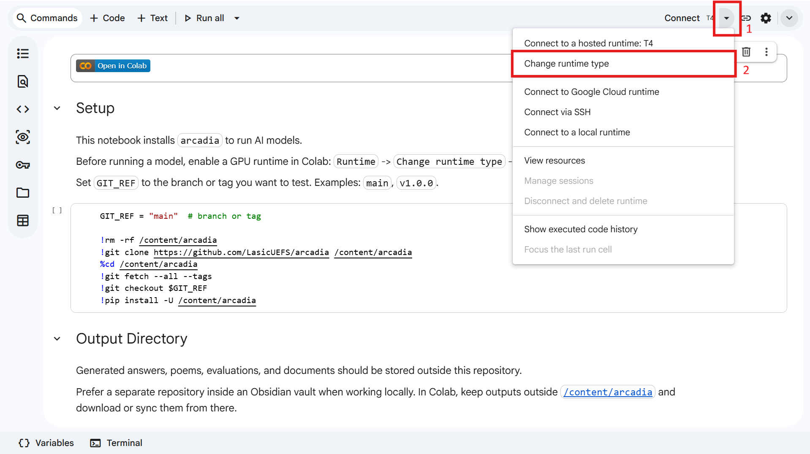

Em seguida:

1. Selecione o ambiente de execução desejado.
2. Mantenha as demais opções inalteradas.
3. Clique em **Salvar**.

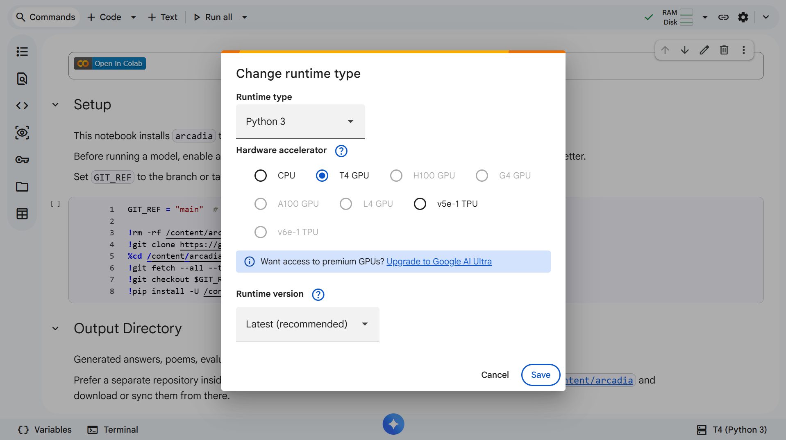

> [!NOTE]
>
> As sessões do Google Colab são temporárias.
>
> Se a sua sessão expirar, basta reconectar o ambiente de execução e continuar de onde parou.

## 3. Instale o Arcadia

Execute a primeira célula de código.

Ela fará o download do Arcadia e das bibliotecas necessárias para o ambiente temporário do Google Colab.

**Nada será instalado permanentemente no seu computador.**

Clique em **Executar** (▶).

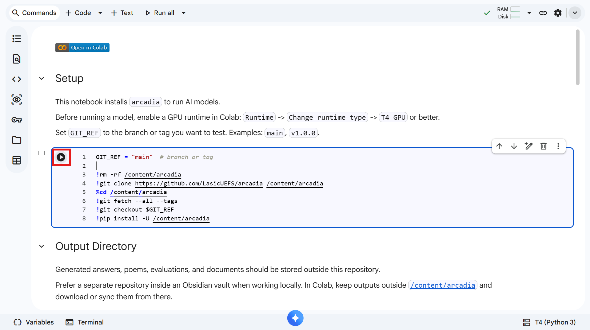

## 4. Configure o arquivo de saída

O Arcadia salva automaticamente suas conversas em um arquivo de saída.

Você pode escolher a pasta onde essas conversas serão armazenadas. Caso não escolha outra, elas serão salvas por padrão na pasta `outputs/`.

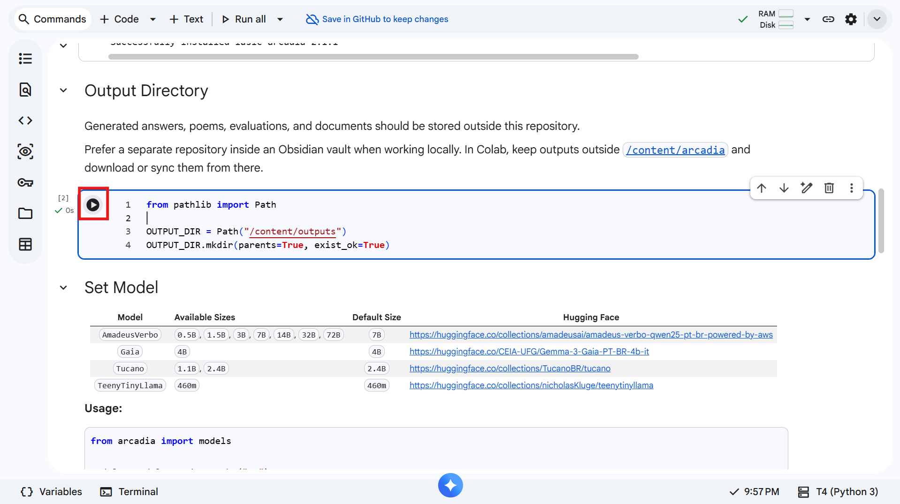

## 5. Configure o token da Hugging Face (Opcional)

> [!TIP]
>
> Esta etapa é opcional.
>
> O Arcadia funciona sem um token da Hugging Face, mas o download dos modelos pode ser mais lento.

### Crie um token

1. Acesse a página de Tokens de Acesso da Hugging Face:
   https://huggingface.co/settings/tokens
2. Clique em **Create new token**.

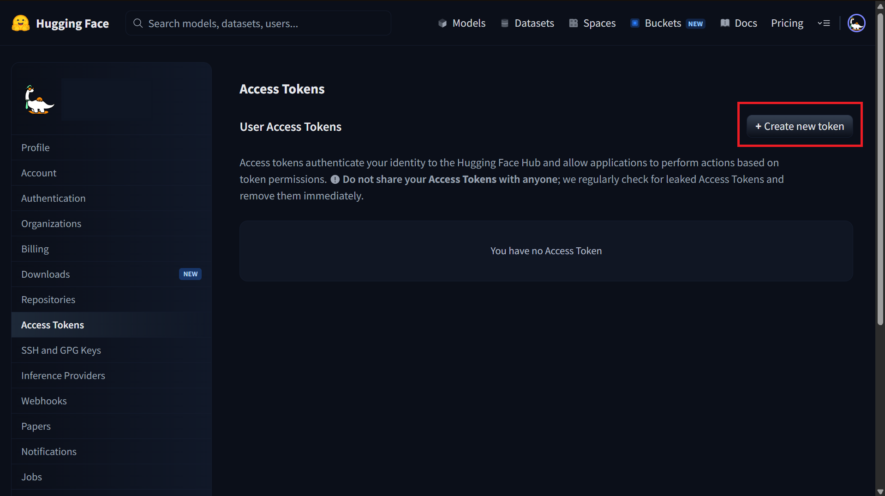

3. Dê um nome ao token, como **Arcadia**.
4. Clique em **Create token**.
5. Copie o token gerado.

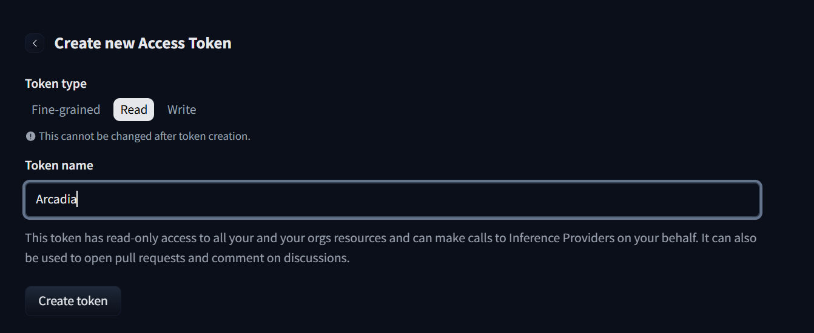

### Configure o token no Google Colab

Abra novamente o notebook.

1. Abra **Secrets** (🔑) na barra lateral esquerda.
2. Ative **Acesso ao notebook**.
3. Crie um segredo chamado **HF_TOKEN**.
4. Cole o token da Hugging Face no campo **Valor**.

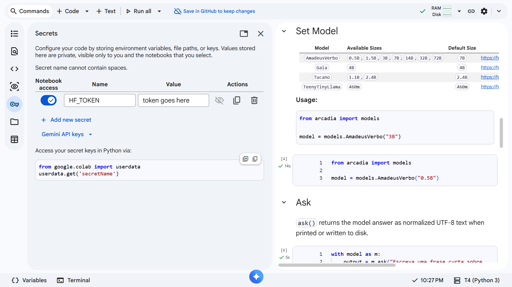

# Escolhendo um modelo de IA

Antes de conversar com a IA, você precisará escolher qual modelo deseja utilizar.
O Arcadia inclui diversos modelos com diferentes tamanhos e capacidades.

## Modelos recomendados

| Modelo | Tamanho padrão |
|---------|----------------|
| Gaia | `4B` |
| AmadeusVerbo | `3B` |
| Tucano | `2.4B` |
| TeenyTinyLlama | `460M` |

Em geral:
- Modelos menores são baixados mais rapidamente e consomem menos memória.
- Modelos maiores costumam gerar respostas de melhor qualidade, mas levam mais tempo para serem baixados.

## A opção mais simples

Na maioria dos casos, basta escrever:

### Gaia

```python
from arcadia import models

model = models.Gaia()
```

### AmadeusVerbo

```python
from arcadia import models

model = models.AmadeusVerbo()
```

### Tucano

```python
from arcadia import models

model = models.Tucano()
```

### TeenyTinyLlama

```python
from arcadia import models

model = models.TeenyTinyLlama()
```

O Arcadia seleciona automaticamente o tamanho recomendado para cada modelo.

## Escolhendo outro tamanho (Avançado)

Se desejar utilizar um tamanho diferente, basta especificá-lo manualmente.

```python
from arcadia import models

model = models.AmadeusVerbo("7B")
```

> [!TIP]
>
> O tamanho informado deve estar entre os tamanhos suportados pelo modelo selecionado.

## Baixando o modelo

Clique em **Executar** (▶).

Na primeira vez que esta célula for executada, o Arcadia irá:

1. Ler a configuração para identificar qual modelo e tamanho você escolheu.
2. Preparar o modelo para uso.
3. Iniciar a conversa.

Dependendo da sua conexão com a internet e do modelo selecionado, esse processo pode levar alguns minutos.

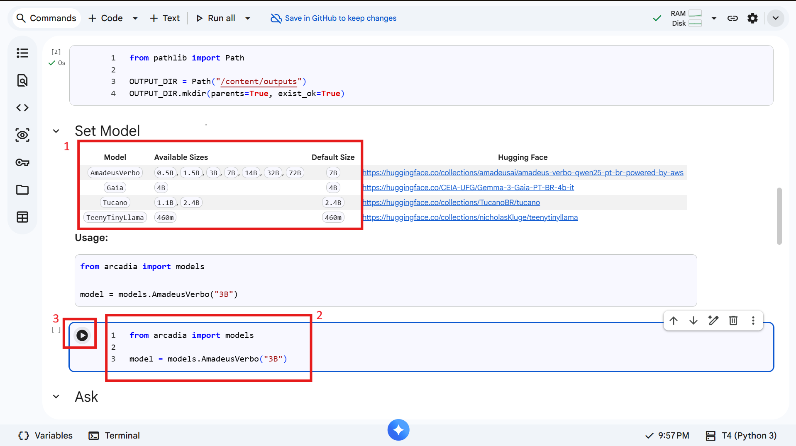

# Conversando com o modelo

## Fazendo sua primeira pergunta

Para fazer uma pergunta:

1. Substitua o texto entre as aspas pela sua pergunta.
2. Clique em **Executar** (▶).
3. Aguarde a resposta aparecer abaixo da célula.

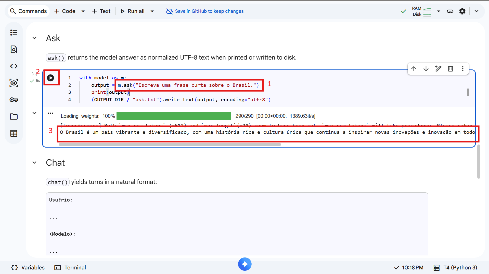

## Continuando a conversa

Se desejar, você pode conversar com o modelo naturalmente.

Na seção **Chat**, o Arcadia lembra as mensagens anteriores, permitindo que você faça perguntas de acompanhamento sem precisar repetir toda a conversa.

Basta:

1. Clicar em **Executar** (▶).
2. Digitar sua primeira mensagem.
3. Ler o histórico da conversa.
4. Escrever sua próxima mensagem.

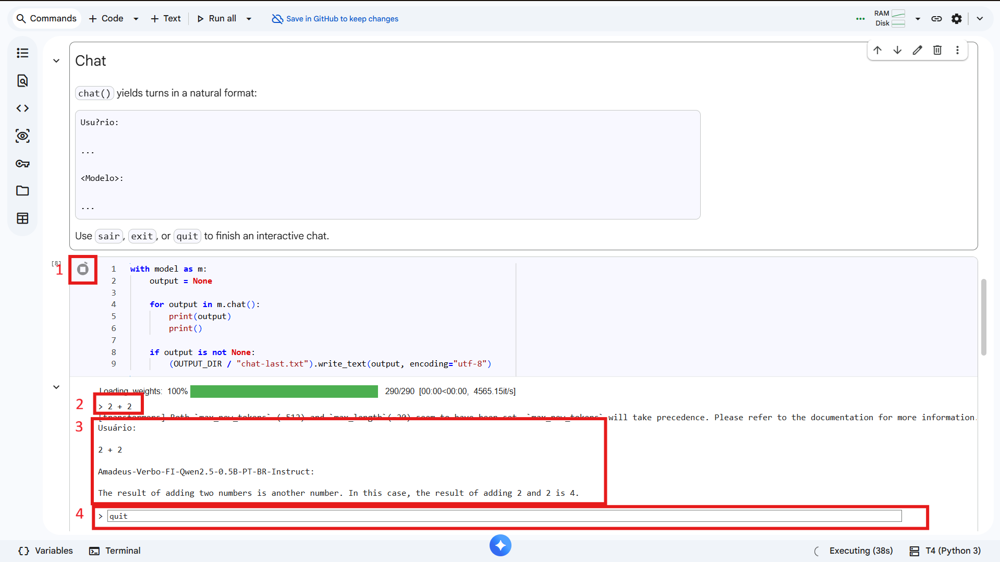

Para encerrar a conversa:

- Digite `sair`; ou
- Digite `exit`; ou
- Digite `quit`; ou
- Clique em **Parar** (⏹).

# Salvando suas conversas

Suas conversas são salvas automaticamente.

Para baixá-las:

1. Abra **Arquivos** (📁).
2. Abra a pasta **outputs**.
3. Clique duas vezes no arquivo desejado.
4. Clique em **⋮** → **Fazer download**.

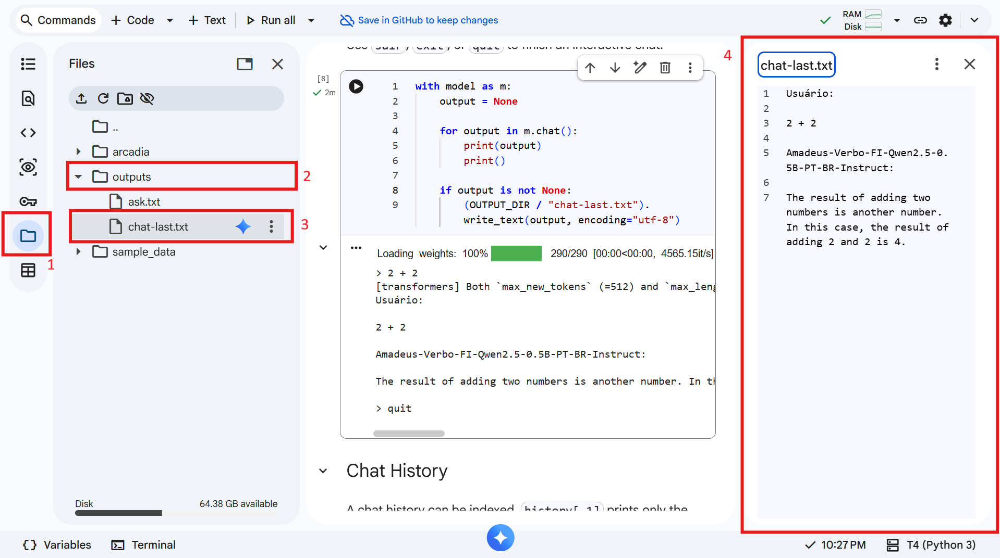

# Próximos passos

Agora que o Arcadia está em execução, você pode:

- Experimentar diferentes modelos de IA.
- Fazer perguntas em linguagem natural.
- Comparar as respostas de diferentes modelos.
- Salvar suas conversas.
- Testar diferentes *prompts*.

À medida que se familiarizar com o Arcadia, você poderá explorar recursos mais avançados e até executar os modelos no seu próprio computador.

---

# Glossário

**Célula**
: Um bloco dentro de um notebook. Algumas células contêm explicações, enquanto outras contêm código que pode ser executado.

**Nuvem**
: Computadores executados pela internet, em vez do seu próprio dispositivo.

**Google Colab**
: Um serviço gratuito do Google que permite executar código Python diretamente no navegador.

**Modelo de Linguagem de Grande Escala (LLM)**
: Um tipo de Inteligência Artificial treinado para compreender e gerar linguagem humana. ChatGPT, Claude, Gemini, Llama e Gaia são exemplos de LLMs.

**Notebook**
: Um documento interativo que reúne texto, código e resultados em um único lugar.

**Código aberto (Open Source)**
: Software cujo código-fonte é disponibilizado publicamente, permitindo que qualquer pessoa o estude, modifique e redistribua.

**Prompt**
: O texto ou a pergunta enviada para a IA.

**Ambiente de execução (Runtime)**
: O computador temporário onde o notebook é executado no Google Colab.

**GPU**
: Um processador especializado que permite executar modelos de IA muito mais rapidamente do que uma CPU convencional.